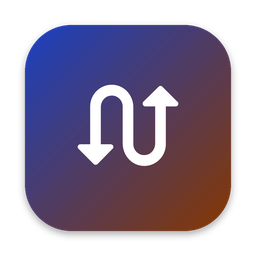
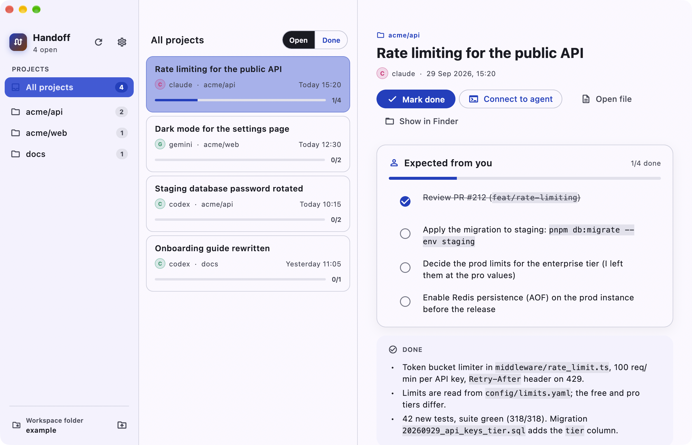
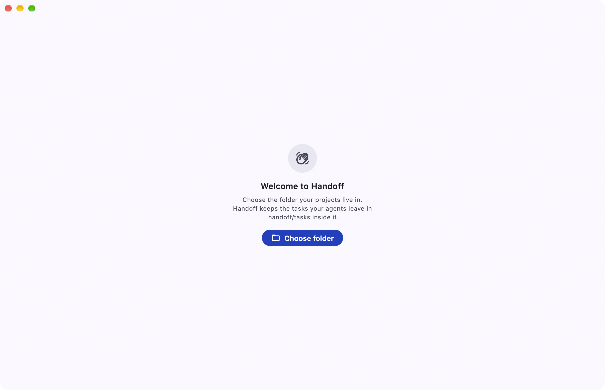
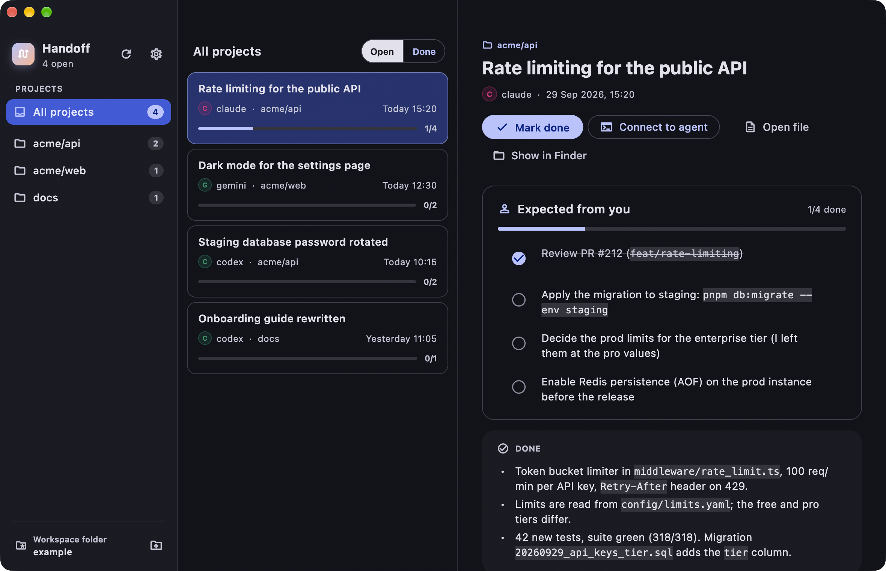

<p align="center">
  
</p>

<h1 align="center">Handoff</h1>

<p align="center">
  <b>From agents to you.</b><br>
  A macOS inbox for the tasks your coding agents leave behind.
</p>

<p align="center">
  <a href="https://github.com/bzkrterdm/handoff/actions/workflows/ci.yaml"></a>
  
  
  <a href="LICENSE"></a>
</p>

<p align="center">
  
</p>

## Quick start

1. **Get the app.** Download `Handoff-<version>-macos.zip` from
   [Releases](https://github.com/bzkrterdm/handoff/releases), unzip, drop
   `Handoff.app` into Applications. It is not notarised yet, so open it once
   with right-click → *Open* (or `xattr -d com.apple.quarantine /Applications/Handoff.app`).
2. **Pick your workspace.** On first start Handoff asks for a folder: choose
   the one your projects live in. It creates `.handoff/tasks` inside and
   watches it.
3. **Hand the protocol to your agent.** Copy
   [`skills/handoff-task/`](skills/handoff-task) into your workspace as
   `.agents/skills/handoff-task/` and add this line to your `AGENTS.md` or
   `CLAUDE.md`:

   > At the end of every session that changed something, follow
   > `.agents/skills/handoff-task/SKILL.md`.

4. **Work as usual.** From now on every agent session ends with a task in
   your inbox: what it did, what you should know, and a checklist of what
   only you can do. Tick, close, or hit *Connect to agent* to pick the
   conversation back up. Nothing gets lost in a transcript again.

No account, no server: the tasks are markdown files in your repository.

## The problem

Claude Code, Codex, Gemini CLI and friends finish a piece of work and the
result lives in a transcript you will never read again. What you actually
need from each session fits on a card: **what was done, what you should
know, and the two or three things only you can do next** (merge the PR,
apply the migration, test on the device, answer a question).

Handoff turns that card into a convention and gives it a window:

- Every agent session ends by writing **one small markdown file** into
  `.handoff/tasks/<project>/` in your workspace. A checklist of what is
  expected from you is the heart of it.
- **Handoff watches the folder** and shows the tasks grouped by project,
  open or done, with progress. Tick a box and the app edits that one line
  in the file. Mark a task done and it stamps `status: done`.
- **Connect to agent** opens a terminal in the task's folder, resumes the
  very session that wrote it, and hands the agent the task file so you can
  continue in conversation.

No server, no account, no database. Plain files in your repository, which
also render on GitHub and in Obsidian, and stay useful when the app is not
running.

## How it works

```
 ┌──────────────┐   writes    ┌────────────────────────────┐   watches   ┌──────────────┐
 │ coding agent │ ──────────► │ .handoff/tasks/<project>/  │ ◄─────────  │   Handoff    │
 │ (end of      │             │   20260929-1420-…-.md      │ ──────────► │  (this app)  │
 │  session)    │ ◄────────── │   - [ ] merge PR #212      │  edits one  │              │
 └──────────────┘  "connect"  │   - [x] apply migration    │    line     └──────────────┘
                    resumes   └────────────────────────────┘
```

1. **Teach your agents the protocol.** Copy
   [`skills/handoff-task/`](skills/handoff-task) into your workspace as a
   skill (`.agents/skills/handoff-task/` works for Claude Code, Codex and
   most agents; Claude Code also reads `.claude/skills/`) and add one line
   to your `AGENTS.md` or `CLAUDE.md`:

   > At the end of every session that changed something, follow
   > `.agents/skills/handoff-task/SKILL.md`.

2. **Point Handoff at your workspace** the first time it starts. The
   workspace is the folder your projects live in; Handoff creates
   `.handoff/tasks` inside it and watches everything below.

   <p align="center">
     
   </p>

3. **Work from the inbox.** New tasks appear as agents finish. Tick, close,
   open the file, or connect to the agent.

## Install

Handoff runs on macOS 12 or later. There is no signed build yet, so pick one:

**From a release.** Download `Handoff-<version>-macos.zip` from the
[Releases](https://github.com/bzkrterdm/handoff/releases) page, unzip, move
`Handoff.app` to Applications. Because the app is not notarised, macOS will
refuse to open it the first time; right-click it and choose *Open*, or run:

```bash
xattr -d com.apple.quarantine /Applications/Handoff.app
```

**From source.** With [Flutter](https://docs.flutter.dev/get-started/install)
3.47 or newer:

```bash
git clone https://github.com/bzkrterdm/handoff.git
cd handoff
flutter pub get
flutter build macos --release -t lib/main_prod.dart
open build/macos/Build/Products/Release/Handoff.app
```

Or run it straight away against the bundled example workspace, no agents
needed:

```bash
flutter run -d macos -t lib/main_dev.dart \
  --dart-define=HANDOFF_TASKS_DIR="$PWD/example/.handoff/tasks"
```

> Handoff reads whatever folder you point it at, so the macOS App Sandbox
> is turned off in the entitlements. It never leaves your machine: the app
> has no network code paths in use.

## Using the app

<p align="center">
  
</p>

- **Sidebar.** Every project that has tasks, with its open count, and the
  workspace folder at the bottom (click to reveal it in Finder, the folder
  button to change it). The gear holds **Language** (system default,
  English, Türkçe) and **Appearance** (system, light, dark).
- **List.** Open or done tasks of the selected project, newest first, with
  the agent, the date and the checklist progress.
- **Detail.** The checklist first, since it is what you act on, then what
  was done, what you should know, and related tasks. Everything is
  rendered from the markdown file; *Open file* and *Show in Finder* take
  you to it.
- **Ticking a box** rewrites that one line in the file (`- [ ]` ↔ `- [x]`).
  Nothing else in the file is touched, ever.
- **Mark done** writes `status: done` and `closed: <now>` into the front
  matter; **Reopen** reverses it after a confirmation.
- **Dock badge** shows the number of open tasks.
- **Connect to agent** opens a new iTerm window (Terminal.app if iTerm is
  not installed) in the task's folder and starts the agent that wrote the
  task, resuming its session when the task records one:

  ```bash
  cd '<workspace>/acme/api' && claude --resume '<session>' '<first message>'
  ```

  The first message, always in English, tells the agent to read the task
  file and walk the checklist with you, ticking items in the file as they
  are finished. Hover an item and press the speech bubble to send a message
  about **that item only**. `claude` and `codex` are supported today;
  anything else falls back to `claude`.

## The task file

```markdown
---
id: 20260929-1420-api-rate-limiting
project: acme/api
title: Rate limiting for the public API
agent: claude
created: 2026-09-29T14:20:00+02:00
status: open
related: []
cwd: acme/api
session: 3f9c1b2e-0000-4000-8000-0f9c1b2e3d4a
---

## Done

- Token bucket limiter in `middleware/rate_limit.ts`, 100 req/min per key.
- 42 new tests, suite green. Migration `20260929_api_keys_tier.sql`.

## Info

- Staging Redis has no persistence; a restart resets every window.

## Actions

- [x] Review PR #212
- [ ] Apply the migration to staging: `pnpm db:migrate --env staging`
- [ ] Decide the prod limits for the enterprise tier
```

Three sections and a checklist. Turkish headings (`Yapılan`, `Bilgi`,
`Senden beklenenler`) and a few English synonyms are recognised as well.
The full reference, including every front matter field and exactly what
the app writes, is in [docs/protocol.md](docs/protocol.md).

## For agents

[`skills/handoff-task/SKILL.md`](skills/handoff-task/SKILL.md) is the
protocol written for the agent: when to leave a task, how to tick the
earlier tasks of the same project first, how to find its own session id so
"Connect to agent" can resume it, and what never goes into a task
(secrets). [`task-template.md`](skills/handoff-task/task-template.md) sits
next to it. Both are plain markdown, so they work with any agent that
reads instructions from the repository.

## Development

```bash
dart format .
flutter analyze
flutter test
```

That is the whole gate, and what CI runs; the app is not built in CI.
The rules of the codebase are in [AGENTS.md](AGENTS.md), the architecture
in [docs/architecture.md](docs/architecture.md) and the task file's mapping
to the model in [docs/data-model.md](docs/data-model.md).

`lib/stack/` is a small clean-architecture stack (base classes, DI,
routing, theming, localization); `lib/features/tasks/` is the app. The task store is one interface
(`TaskDataSource`); the markdown folder is its only implementation today,
and a remote one can be added without touching the UI.

## Roadmap

- Keyboard: ↑↓ through tasks, space to tick, ⌘R to refresh.
- Search and filters (agent, date).
- More agents for "Connect to agent" (Gemini CLI, …).
- An optional remote store, so the inbox follows you across machines.

Ideas and bug reports are welcome as issues; see
[CONTRIBUTING.md](CONTRIBUTING.md).

## License

[MIT](LICENSE).
